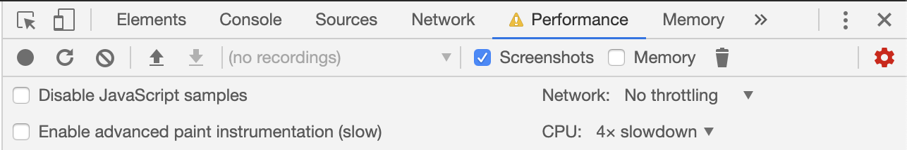
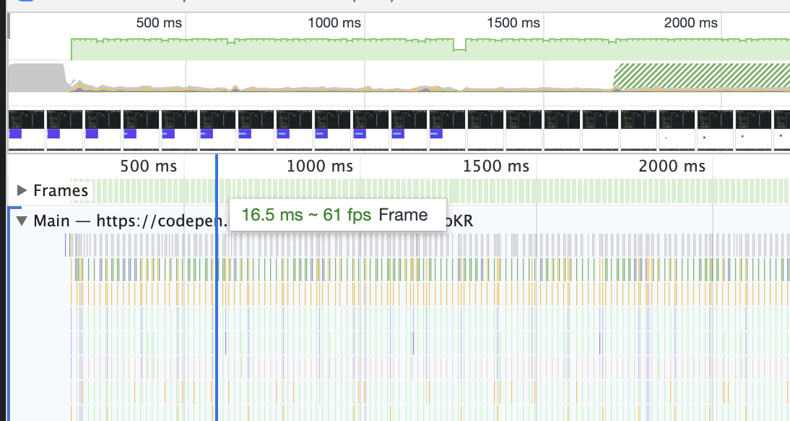
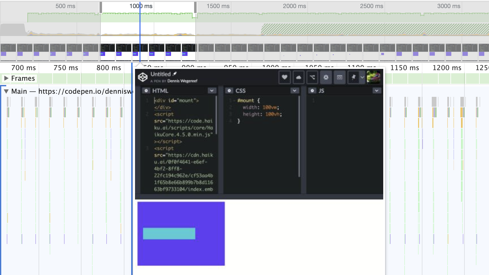
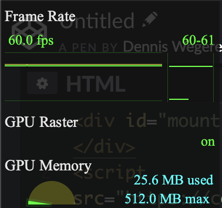
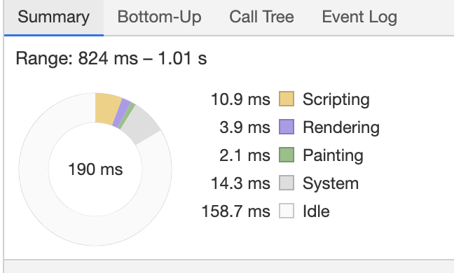

## How to check animation in your browser?

Luckily maby without even that you aware off the browser gives us tons of information about animations. It is easy to analyse the animation even to the smallest details. We gonna use the Chrome devtools for this.

### Throttle CPU

Maybe if you’re reading this on your brand new Macbook pro all maxed out on specs of course your machine has a way easier time to handle complex and many animations at once. So it is hard to only rely on your own machine to know if something works just fine. Luckily for you there is a way to throttle your CPU. Even to bring it down that you can simulate phones with much less CPU.

When you open the devtools you have to do a few steps to make it work

1. Click the performance tab
   Make sure that screenshots checkbox is enabled
2. Click **capture settings** than it shows settings related to how it captures performance metrics
3. Than select the CPU and select the 4x slowdown, it throttles now your current website

### Runtime performance

You can record the performance of your current page when the devtools are enabled on the performance tab. Push in the top left corner the grey round dot. It turns red and reload the page, wait until you’re satisfied with how much you wanna capture and check and click stop. You get the big graph with multiple things inside it, let’s make a little bit more sense of that.

Since this is article is mostly focused around hitting that sweet 60fps mark that you wanna achieve. In the middle row under the frames tab. It shows green boxes how much FPS there is, if they all are green and equal height than means you reached some steady frames. When there are red boxes showing it shows that it dropped than you know somewhere in your animation there is a bottleneck.

Above that there is a CPU graph, you can see how hard your machine has to ‘think’ and ‘calculate’ to handle all the painting in the screen. How more color and darker, that means the CPU is maxed out with that recording. So there is a-lot to optimize there. If you mouseover it you can see that a screenshot of each frame is showing, makes it really easy to see what is happening during that animation.

### FPS meter

Another great tool to quickly view your FPS on your current screen is to open the FPS meter build in Google Chrome. It shows in real time how much FPS and GPU the computer is current using. You can open it in the following steps:

1. Open the devtools
2. Command+Shift+P (Mac) or Control+Shift+P (Windows, Linux) to open the fast search menu
3. Type ‘Rendering’ and than select ‘Show Rendering’
4. Find ‘FPS Meter’ in the rendering tab and enable it

Also a fun thing to see is the paint that needs to be redrawn every frame. Also in the same options menu click `Paint flashing` and everything on the page turns green that has been drawn again.

---

As mentioned in the first article the timeline, how much time each part had taken. You can see how much it costs to finish a task. But there a way more functions inside the performance tab that I can’t show you right now. For a full read up I suggest you read [How to Use the Timeline Tool from Google](https://developers.google.com/web/tools/chrome-devtools/evaluate-performance/timeline-tool).

## But how to get that 60fps

Well, since all the steps in the timeline has to be done, remember we talked about the GPU. It is a great piece of technology specifically built and optimized to do some tasks parallel of the browser. That is one of the main keys to get that 60fps.

Compositing the layers on the GPU is much more efficient than do it on the CPU in the browser. And as mentioned above they work together. But how do we actually say what needs to be GPU rendered?

In fact not all CSS properties are made equal to each other. When some of their values change some trigger a complete repaint of their component and children, and some only trigger the repaint that needed. When properties needs to recompute the whole layout that is a task that's needs to be done on the CPU, so when it is possible we need to avoid those properties as much as possible.

There is a website called [csstriggers](https://csstriggers.com/) where you can see what things in the pipeline it needs. But let me spoil a bit transform and opacity are the properties you want to use. That's the thing when those properties are called none of the other elements in the page are affected and the browser can just paint the difference and doesn't need to calculate anything.

You know you want maby to create an animation that is moving away from the top of the screen, you could probably use to animate the `margin-top: 100px` or the `top: 100px` property on it's when it is a `absolute` element. For a single element there shouldn't really be much difference but when there are children inside and the page has much more elements. The browser needs to calculate a lot on the fly. You could help the browser with it to actually use the `transform: translateY(100px)` property. That's how easy it is to take advantage of the GPU rendered properties.

There is also a `will-change: transform` attribute. Where you can create a element on its own GPU layer so the browser knows beforehand what to do with it when it is starting to animate. Maybe now you think why not put on every element on the page that property, well. Every composite layer now consumes additional memory. Memory is a precious resource on mobile devices. When there is a memory overload you could crash the browser and trust me that something you don't want. And promoting a whole element to the composite layer only, that can be very slow in browsers sometimes.

### Testing mobile animations

When creating animations it is easy to spot mistakes in terms of performance when you test early and a-lot on your phone. Most websites are build on the computer and people test only on the machine their building on. So mobile testing comes afterwards when someone is already finished building the whole animation. Some animation techniques just don't perform well on mobile phone (also canvas animations). But what is funny now that most new high end phones are much faster than most laptops nowadays. That animations even look smoother than on your own computer. Than you can always CPU throttle your machine as stated above in the timeline part to recreate a slower machine.

Since the grown of mobile users it more important than ever to test on it frequently. But there are more factors that can drastically affect the performance. Such as: is a screen retina or not? How old is the hardware of it? Or what browser are you using. Chrome and safari seems familiar to each other but they have their own small issues. Each update can fix some things, but also can introduce new bugs. You don't want to lose out on animations that you only think that slow machines are viewing your website, progressive enhancement is a nice thing to do. Such as using media queries if several features are available on that device. Otherwise you can maby play no animation or a lighter version of it. There is also a way to find the pixel density of properties and figuring out what OS type is used on the device, so you can anticipate on that.
