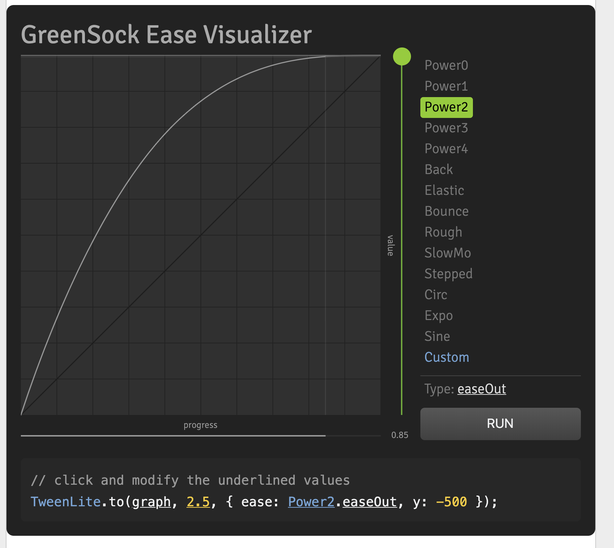

## Javascript animation?

We talked mostly only about animations created with CSS. People really tend to lean forward because there are a-lot of counter arguments to not use a animation library. Personally I think it really depends what you wanna create, there is no right answer for everything. All of the javascript libraries are just adding CSS properties on the right moment to animate. It gives just a little bit more control.

But just CSS if you know what you do it is one of the most performant toolings around there. You don't have to load another library you get everything out the box. In combination with Less or Sass you can do some really nice keyframe animations. Also there is a possibility to listen to `onAnimationEnd` to hook in with javascript. Also for responsive development you can use regular media queries to change or maybe disable animations.

But it sounds all great but there are some disadvantages about it. The bezier easing can be a little restrictive of using. You have 2 handles to move and have to great a curve in between them. For simple effects it is great but if you wanna have a more complex realistic physical feeling it is harder to do. Change a-lot of animations can get quite ugly and hard to maintain when you go beyond three animations in a row having that control in JavaScript makes it so much more easier. Also using SVG to animate is harder with only native css and sometimes especially on mobile you need some hacks to get it right.



Let's pick for example an animation library and see what it can do, my pick of choice is currently `Greensock (GSAP)`. Well what nice is about Greensock it is almost a industry standard on web animations. It is really performant compared to just native CSS animations, it performs just as well which is a major point. Since the creators really focused on making it performant so it tries the best for you already. You can easily timeline animations what makes it really easy to time exact some animations and you can fire multiple animations at once. Also there are tons of plugins if you wanna do something like morphing SVG's, draw paths or animate text. As mentioned above you can create some complex easing curves with a wide range of support. But most importantly if you wanna just not think about the fact that it solves a lot of cross-browser issues out of the box, especially for mobile. But the downside is for smaller projects when you just wanna have some nice hover animations, or single tweening it is most of the time an overkill to load in a 'heavy' extern library and than it is just not worth the cost.

```js
// instantiate TimelineMax
const tl = new TimelineMax();

// scale down the text
// and hide it before the animation begins
tl.set(".example__title", {
  scale: 0.2,
  autoAlpha: 0
})
  // scale the circle shape down before
  // the animation begins
  .set(".example__ball", {
    scale: 0.2
  })
  // tween 1: rotate shape on X and Y axis
  // scale it up to its regular dimensions
  // add a fun ease
  .to(".example__ball", 0.5, {
    rotationX: 360,
    rotationY: 180,
    scale: 1,
    ease: Elastic.easeIn.config(2, 1)
  })
  // tween 2: make text appear and
  // scale it up to its regular size
  // add a fun ta-da ease
  .to(".example__title", 0.5, {
    autoAlpha: 1,
    scale: 1,
    ease: Back.easeOut.config(4)
  });
```

In the chrome browser you also have some CSS controls to pause and resume CSS keyframe animations but that's about it. You can not easily jump to a particular spot in the animation. Javascript animation libraries provides some nice handles to actually do that. You can easy pause, reverse, restart and slow down an animation with sometimes a simple click on a button. Much easier to debug and see what is actually happening and you get it for free for just using it.

But all in the end it comes down to your own opinion what you like to use. It is really ease to get started with so many different libraries. I only mentioned GSAP but you also have `anime.js`, `Velocity JS` or `Bodymovin` all with their different view on how it should be done. Just play around with it and see whatever suits you the best.
